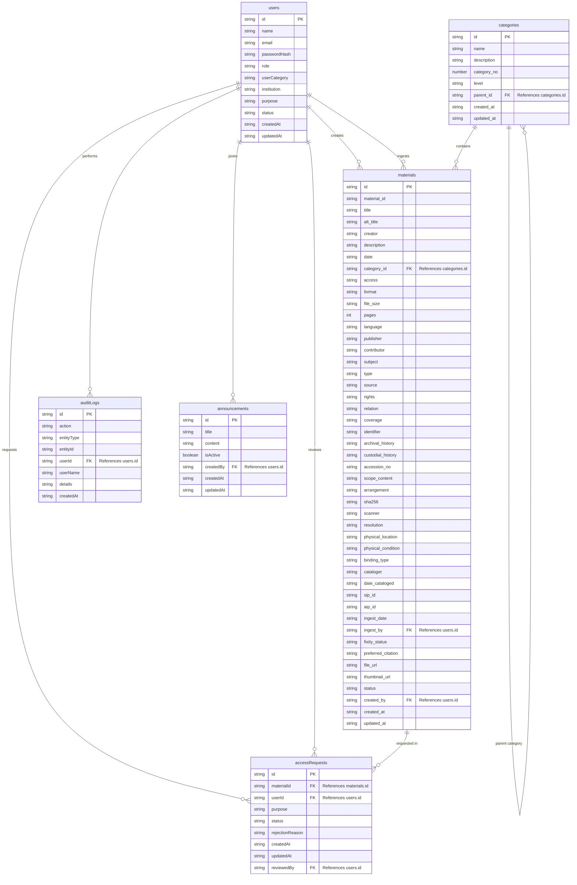

# iArchive — HCDC Digital Archival Collection System

> OAIS-compliant digital repository for Holy Cross of Davao College (HCDC), built to preserve, organize, and provide controlled access to institutional records and research materials.

---

## 1. Product Overview

**iArchive** is a web-based archival management platform designed for the Holy Cross of Davao College (HCDC). It digitizes and catalogs institutional memory — yearbooks, research papers, strategic plans, board minutes, and historic photographs — using international archival standards (ISAD(G), Dublin Core, OAIS ISO 14721:2012).

The system serves three user roles — **Administrators**, **Archivists**, and **Public Users (Students/Researchers)** — each with distinct access privileges and dashboards.

### Core Value Proposition

| Capability | Description |
|---|---|
| **ISAD(G) Metadata** | Full 26-element International Standard Archival Description with 7-area breakdown |
| **Dublin Core** | 15-element Dublin Core metadata set, cross-mapped with ISAD(G) |
| **OAIS Compliance** | ISO 14721:2012 lifecycle management (SIP → AIP → DIP) |
| **Role-Based Access** | Three-tier access control: Public, Restricted, Confidential |
| **Fixity Verification** | SHA-256 checksum integrity for all Archival Information Packages |
| **Metadata Export** | CSV export of metadata for individual or batch materials |

---

## 2. Technology Stack

| Layer | Technology |
|---|---|
| **Frontend Framework** | React 19 + TypeScript |
| **Build Tool** | Vite 7 |
| **Styling** | TailwindCSS 4, Class Variance Authority |
| **Routing** | Wouter (lightweight client-side router) |
| **State Management** | TanStack React Query + localStorage |
| **Animations** | Framer Motion |
| **Icons** | Lucide React |
| **UI Components** | Radix UI primitives (Dialog, Select, Tabs, Toast, Tooltip, etc.) |
| **Date Handling** | date-fns |
| **Backend (Dev mode)** | Vite middleware mock API plugin (see `vite.config.ts`) |
| **Backend (Production)** | Express + Firebase Admin SDK (Auth + Firestore) |
| **Package Manager** | pnpm 9.15.4 (monorepo workspace) |

### Monorepo Structure

```
Archive-Keeper/
├── artifacts/
│   └── iarchive/              ← Main frontend application (this project)
│       ├── src/
│       │   ├── pages/         ← All route pages
│       │   ├── components/    ← Reusable UI components
│       │   ├── data/          ← Sample data, storage layer, metadata utilities
│       │   └── hooks/         ← Custom React hooks
│       ├── public/            ← Static assets (logos, images)
│       ├── vite.config.ts     ← Vite config + mock auth/API plugin
│       └── package.json
├── lib/
│   ├── api-client-react/      ← Shared React Query hooks (@workspace/api-client-react)
├── api-server/                ← Express/Node backend (for production)
├── vercel.json                ← Deployment configuration
└── pnpm-workspace.yaml        ← Workspace definition
```

---

## 3. Pages & Routes

### 3.1 Public Pages

| Route | Page | Purpose |
|---|---|---|
| `/` | **Home** | Landing page with hero section, featured collections, horizontal-scroll feature cards, archival framework steps, access level explanations, user role cards, stats counter, and CTA. |
| `/login` | **Login** | Email/password login form. Demo credentials: `admin@hcdc.edu.ph` / `admin123`, `archivist@hcdc.edu.ph` / `admin123`, `student@hcdc.edu.ph` / `admin123`. |
| `/register` | **Register** | Account registration form (requires admin approval before access is granted). |
| `/collections` | **Collections** | Public browsable archive with search, OAIS-only toggle, access level filters, grid/list view modes. Displays all materials from localStorage with cover images, access badges, and OAIS compliance indicators. |
| `/materials/:id` | **Material Detail** | Full detail view for a single archival item: multi-page document viewer with thumbnail strip, zoom controls, fullscreen mode, ISAD(G) metadata tabs (Details, Dublin Core, Related Items), access restriction enforcement, and terms of use display. Includes "Download Metadata" CSV export button. |
| `/about` | **About** | About OAIS (Open Archival Information System) educational page. |
| `/terms` | **Terms** | Terms of service / usage policy. |
| `/request-access` | **Request Access** | Form for researchers to petition access to restricted/confidential materials. |

### 3.2 Admin Pages (requires `admin` role)

| Route | Page | Purpose |
|---|---|---|
| `/admin` | **Dashboard** | Metadata & Compliance Dashboard: ingestion velocity chart, critical alerts (pending requests, incomplete metadata), stat cards (total materials, fully described count, essential compliance %, average completion %), materials overview table with filter tabs (All / Complete / Partial / Incomplete), expandable record detail panels with ISAD(G) area breakdown, essential field checklist, completion rings, and full metadata table. Activity feed. |
| `/admin/collections` | **Archival Materials** | Full material management: hierarchical tree browser (ISAD(G) fonds → item), search/filter, paginated material list with accordion expansion, inline metadata editing (all 36 fields), **Ingest New Material** workflow (file upload → page preview → access control → metadata checklist), "Export Metadata" CSV batch download, "Download Metadata" per-item CSV, metadata checklist dialog. |
| `/admin/requests` | **Access Requests** | Review and approve/reject material access requests from researchers. |
| `/admin/audit` | **Audit Logs** | System-wide activity log tracking all user actions. |
| `/admin/users` | **User Management** | View active users, approve/reject pending registrations, manage roles. |
| `/admin/categories` | **Categories** | CRUD for collection series/categories. |
| `/admin/announcements` | **Announcements** | Create and manage system-wide announcements. |

### 3.3 Role-Specific Dashboards

| Route | Page | Purpose |
|---|---|---|
| `/archivist` | **Archivist Dashboard** | Archivist-specific view. Shares collections/categories/requests pages with admin. |
| `/archivist/collections` | Shared | Same as `/admin/collections` |
| `/archivist/categories` | Shared | Same as `/admin/categories` |
| `/archivist/requests` | Shared | Same as `/admin/requests` |
| `/student` | **Student Dashboard** | Student-specific dashboard for browsing accessible materials. |

---

## 4. Key Features in Detail

### 4.1 Material Ingestion Workflow

The admin ingestion flow follows a strict linear sequence:

```
┌─────────────────┐    ┌──────────────────┐    ┌──────────────────┐    ┌───────────────────┐
│  1. Setup        │───▶│  2. Page Preview  │───▶│  3. Access Control│───▶│  4. Metadata      │
│  Archival Item   │    │  (Mandatory)      │    │  Level Selection  │    │  Checklist         │
│                  │    │                   │    │                   │    │  + Finalize Ingest  │
│  - Upload file   │    │  - Visual preview │    │  - Public         │    │  - ISAD(G) fields  │
│  - Hierarchy     │    │  - Page thumbnails│    │  - Restricted     │    │  - Dublin Core     │
│  - Title/Creator │    │  - OCR extraction │    │  - Confidential   │    │  - Terms of Use    │
│  - Auto-detect   │    │  - Full-text scan │    │  - Terms of Use   │    │  - Save to storage │
└─────────────────┘    └──────────────────┘    └──────────────────┘    └───────────────────┘
```

**Supported file types:** PDF, DOCX, XLSX, images (JPG/PNG/TIFF), video (MP4)

**PDF Processing:**
- Visual thumbnail extraction: first 10 pages (to prevent localStorage quota issues)
- Full-text extraction: all pages (for metadata inference)
- Automatic title, creator, and date detection from extracted text

### 4.2 Metadata Standards

#### ISAD(G) — 26 Elements across 7 Areas:

| Area | Fields |
|---|---|
| **1. Identity Statement** | Reference Code, Title, Dates, Level of Description, Extent and Medium |
| **2. Context** | Name of Creator, Administrative/Biographical History, Archival History, Immediate Source |
| **3. Content & Structure** | Scope and Content, Appraisal, Accruals, System of Arrangement |
| **4. Conditions of Access** | Access Conditions, Reproduction Conditions, Language, Physical Characteristics, Finding Aids |
| **5. Allied Materials** | Existence of Originals, Existence of Copies, Related Units, Publication Note |
| **6. Notes** | Note |
| **7. Description Control** | Archivist's Note, Rules/Conventions, Date(s) of Description |

#### Dublin Core — 15 Elements (with cross-mapping):

Title, Creator, Subject, Description, Publisher, Contributor, Date, Type, Format, Identifier, Source, Language, Relation, Coverage, Rights

### 4.3 Access Control System

| Level | Badge Color | Who Can View | Description |
|---|---|---|---|
| **Public** | Green | Everyone | No restrictions. Freely browsable. |
| **Restricted** | Amber | Approved researchers + Staff | Requires an approved access request. First 3 pages visible as preview. |
| **Confidential** | Red | Admin + Archivist only | Board authorization required. Locked content with request workflow. |

### 4.4 Storage Architecture

The application uses **browser localStorage** as the persistence layer (no backend database required for the frontend demo):

- **Materials:** Stored under `iarchive_materials` key
- **Activity Log:** Stored under `iarchive_activity` key
- **Version Control:** `iarchive_version` key tracks sample data schema version
- **Quota Protection:** Automatic pruning of page images when quota is exceeded (strips thumbnails from older materials progressively)

**Sample Data:** 6 pre-loaded materials with varying metadata completion levels (100%, 90%, 70%, 50%, 33%, 17%) for demonstration purposes.

### 4.5 OAIS Compliance Checking

A material is considered OAIS-compliant when all 6 essential ISAD(G) fields are filled:
1. Reference Code
2. Title
3. Dates
4. Level of Description
5. Extent and Medium
6. Name of Creator

### 4.6 Metadata Export

- **Batch Export:** "Export Metadata" button in admin toolbar downloads a CSV of all visible (filtered) materials
- **Individual Export:** "Download Metadata" button on each material's detail view and admin accordion exports a single material's key-value pairs as CSV

### 4.7 Archival Hierarchy (ISAD(G) Multi-Level Description)

```
HCDC (Fonds)
├── College of Engineering & Technology (Sub-fonds)
│   ├── Faculty Research (Series)
│   │   └── Research Papers (Sub-series)
│   │       └── 2023 Faculty Publications (File)
│   │           └── Quality Education in Philippine HEIs (Item)
│   ├── BLIS (Series)
│   ├── BSCpE (Series)
│   ├── BSECE (Series)
│   └── BSIT (Series)
├── Administrative Records (Sub-fonds)
│   ├── Strategic Plans (Series)
│   └── Board Minutes (Series)
├── Publications (Sub-fonds)
│   └── Yearbooks (Series)
├── Photographs (Sub-fonds)
│   └── Historic Photos (Series)
├── CCJE (Sub-fonds)
├── CHATME (Sub-fonds)
├── HUSOCOM (Sub-fonds)
├── COME (Sub-fonds)
├── SBME (Sub-fonds)
└── STE (Sub-fonds)
```

---

## 5. Authentication System

### Development Mode (Mock Auth)

The Vite dev server includes a built-in mock authentication plugin (`vite.config.ts` → `mockAuthPlugin()`) that simulates a full auth API:

| Endpoint | Method | Purpose |
|---|---|---|
| `/api/auth/login` | POST | Authenticate with email/password |
| `/api/auth/me` | GET | Get current user profile (JWT required) |
| `/api/auth/logout` | POST | Clear session |
| `/api/auth/register` | POST | Submit registration (pending approval) |

**Demo Credentials:**

| Role | Email | Password |
|---|---|---|
| Administrator | `admin@hcdc.edu.ph` | `admin123` |
| Archivist | `archivist@hcdc.edu.ph` | `admin123` |
| Student | `student@hcdc.edu.ph` | `admin123` |

### JWT Handling

- Tokens stored in `localStorage` as `iarchive_token`
- Global fetch interceptor automatically attaches `Authorization: Bearer <token>` header
- 401 responses on protected paths trigger automatic logout and redirect to `/login`

---

## 6. Mock API Endpoints

All API endpoints are mocked via the Vite middleware plugin for development:

| Endpoint | Methods | Description |
|---|---|---|
| `/api/materials` | GET, POST, PUT, DELETE | Full CRUD for archival materials |
| `/api/categories` | GET, POST, PATCH, DELETE | Collection series management |
| `/api/users` | GET | List users (with `?status=pending` filter) |
| `/api/admin/approve-user` | POST | Approve pending registration |
| `/api/admin/reject-user` | POST | Reject pending registration |
| `/api/requests` | GET, POST | Material access requests |
| `/api/requests/:id/approve` | POST | Approve access request |
| `/api/requests/:id/reject` | POST | Reject access request |
| `/api/announcements` | GET, POST, DELETE | System announcements |
| `/api/stats` | GET | Dashboard statistics |
| `/api/audit` | GET | Audit log entries |

---

## 7. Custom Components

| Component | File | Purpose |
|---|---|---|
| **AdminLayout / PublicLayout** | `layout.tsx` | Responsive sidebar navigation for admin, clean header for public pages |
| **ArchivalTree** | `ArchivalTree.tsx` | Interactive hierarchical tree browser (fonds → item) |
| **MetadataChecklist** | `MetadataChecklist.tsx` | ISAD(G) + Dublin Core field completion checklist with area grouping |
| **CompletionRing** | `CompletionRing.tsx` | SVG donut chart for metadata completion percentage |
| **FieldHeatmap** | `FieldHeatmap.tsx` | Visual heatmap of metadata field completion across materials |
| **Barcode** | `Barcode.tsx` | SVG barcode generator for unique material IDs |
| **PageViewer** | `MaterialDetail.tsx` | Multi-page document viewer with thumbnails, zoom, rotate, fullscreen |

---

## 8. Running Locally

### Prerequisites

- Node.js ≥ 20.10.0
- pnpm 9.15.4

### Development

```bash
cd artifacts/iarchive
pnpm install
pnpm dev
```

The app will be available at `http://localhost:5173`.

### Production Build

```bash
pnpm build
pnpm serve
```

Output directory: `artifacts/iarchive/dist/public`

---

## 9. Deployment (Vercel)

### Current Configuration (`vercel.json`)

```json
{
  "buildCommand": "pnpm --filter @workspace/iarchive build",
  "outputDirectory": "artifacts/iarchive/dist/public"
}
```

### Known Deployment Issues

1. **Monorepo `file:` Dependencies:** The `package.json` references `@workspace/api-client-react` via `file:../../lib/...` paths. Vercel's install step must resolve these correctly within the monorepo.

2. **Missing `installCommand`:** Vercel needs an explicit install command for pnpm monorepos. Add:
   ```json
   "installCommand": "pnpm install --frozen-lockfile"
   ```

3. **Root Directory:** Vercel must be configured with the root directory set to the **monorepo root** (not `artifacts/iarchive`), so workspace resolution works.

4. **Node.js Version:** Ensure Vercel is set to Node.js 20.x+ in project settings.

5. **Mock API in Production:** The `mockAuthPlugin()` in `vite.config.ts` runs during dev only (Vite middleware). In production builds, all `/api/*` calls will 404 unless a real backend is deployed separately.

---

## 10. Environment Variables

| Variable | Default | Description |
|---|---|---|
| `PORT` | `5173` | Dev server port |
| `BASE_PATH` | `/` | Base URL path for deployment |
| `FIREBASE_PROJECT_ID` | (none) | Firebase project ID (api-server) |
| `FIREBASE_SERVICE_ACCOUNT_JSON` | (none) | Firebase Admin service account JSON (api-server) |
| `FIREBASE_API_KEY` | (none) | Firebase web API key for email/password login (api-server) |

---

## 11. Design System

### Color Palette

| Token | Hex | Usage |
|---|---|---|
| Primary Navy | `#0a1628` | Headers, dark backgrounds, body text |
| HCDC Red | `#960000` | Institutional branding, confidential badges, hero accents |
| Royal Blue | `#4169E1` | Primary action color, links, active states |
| Emerald | `#10B981` | Success states, public badges, OAIS compliance |
| Amber | `#F59E0B` | Warning states, restricted badges |

### Typography

- **Display Font:** System serif (italic) for hero headings
- **Body Font:** System sans-serif (Inter-like) for all UI text
- **Mono Font:** System monospace for IDs, codes, barcodes

---

## 12. Splash Screen

On first visit per session, a premium animated splash screen displays:
- HCDC iArchive logo with glow animation
- "Preservation · Integrity · Access" tagline
- Animated progress bar
- Session flag (`sessionStorage`) prevents re-display on subsequent navigations

---

## 13. Database Schema (ERD)

The iArchive platform organizes data into several core collections in Firestore (or Local JSON during development). Below is the Entity-Relationship Diagram representing the relationships between Users, Materials, Categories, Access Requests, Audit Logs, and Announcements.



---

## 14. License

© 2026 Holy Cross of Davao College. All rights reserved.
Unauthorized reproduction prohibited.

